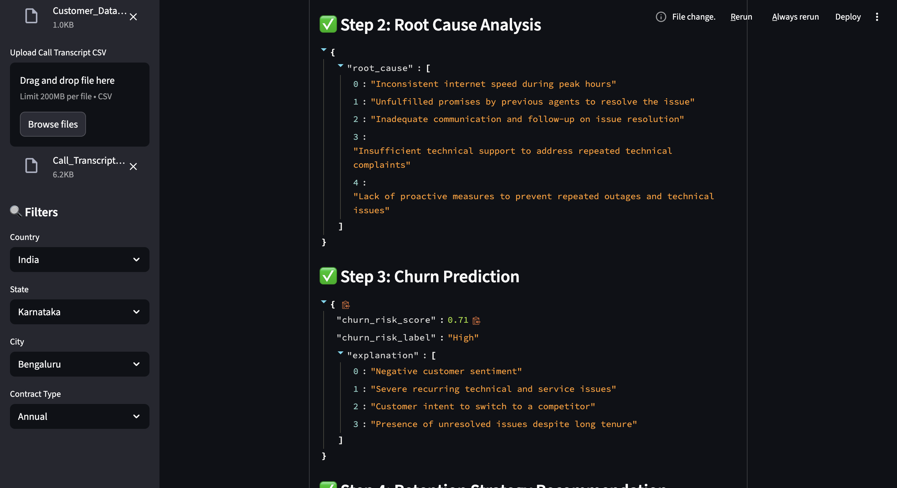
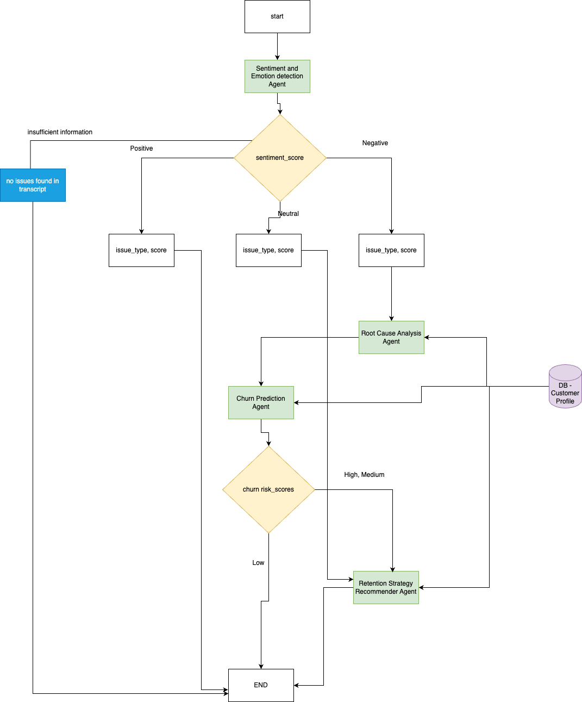

# Agentic Customer Churn Analyzer

An end-to-end AI-driven pipeline that analyzes customer service call transcripts to:

* Detect **sentiment and tone**
* Uncover **root causes**
* Predict **churn risk**
* Recommend **retention strategies**

Built using **CrewAI**, **LiteLLM**, and **Streamlit** with OpenRouter-supported LLMs.

---

## Features

* 📁 Upload and analyze customer and transcript CSV files
* 🔎 Filter by location, contract type, and other criteria
* 🤖 Real-time execution of a 5-step agent pipeline:

  * Customer Profile Summarization
  * Call Transcript Sentiment Analysis
  * Root Cause Analysis
  * Churn Prediction
  * Retention Strategy Recommendation
* ⏱️ Live progress tracking and JSON output per customer
* 📊 Final results exportable as a CSV

---

## Agent Architecture

The system uses the **CrewAI** framework to orchestrate agents. Each agent specializes in a unique task to assess churn risk and recommend retention strategies:

* **Customer Profile Summarizer**: Summarizes key attributes
* **Sentiment Analyzer**: Detects sentiment, tone, keywords, and intent
* **Root Cause Analyzer**: Extracts reasons for dissatisfaction
* **Churn Risk Predictor**: Quantifies and labels churn risk
* **Retention Strategy Recommender**: Suggests personalized next steps

---

## Technical Stack

| Component                  | Description                               |
| -------------------------- | ----------------------------------------- |
| `CrewAI`                   | Manages agent-task orchestration          |
| `LiteLLM` + `OpenRouter`   | Connects to open-access LLMs like Mistral |
| `Streamlit`                | Interactive dashboard                     |
| `Pandas`, `JSON`, `dotenv` | Data processing and config handling       |

Agents and tasks are dynamically loaded from YAML files:

* `src/config/agents.yaml`
* `src/config/tasks_sentiment.yaml`, `tasks_churn_risk.yaml`, etc.

---

## Repository Structure

```
├── app.py                          # Streamlit app entrypoint
├── main.py                         # Core pipeline execution
├── /agents                         # CrewAI agent definitions
├── /output                         # Folder for generated JSONs per customer
├── /Input
│   ├── Customer_Data.csv           # Sample customer file
│   └── Call_Transcript_Data.csv    # Sample call transcript file
├── /src/config/                   # Agent and task configuration YAMLs
│   └── agents.yaml
│   └── tasks_sentiment.yaml
│   └── ...
├── UI.png                          # Screenshot of the dashboard
```

---

## Streamlit Dashboard Preview



---

## How to Run

### Clone the repo

```bash
git clone https://github.com/tiyasa94/agentic-call-transcript.git
```

### Installation

```bash
pip install -r requirements.txt
```

### Setup Environment

Create a `.env` file:

```env
OPENROUTER_API_KEY=your_api_key_here
```

### Launch Streamlit

```bash
streamlit run src/app.py
```

---

## Outputs

Each customer gets:

* A dedicated folder under `/output/{customer_id}/`
* Agent outputs: `sentiment.json`, `rootcause.json`, `churn_risk.json`, `retention_recommender.json`
* CSV download of all filtered customer insights

---

## Deployment

### Docker

```bash
docker build -t call_transcript_analytics .
docker run -p 8080:8080 call_transcript_analytics
```

---

## Architecture Diagram



---

## Contributing

1. Fork the repository
2. Create a new branch (`feature-xyz`)
3. Commit changes (`git commit -m "Added feature xyz"`)
4. Push to the branch (`git push origin feature-xyz`)
5. Open a Pull Request

---

## Contributor

**Tiyasa Mukherjee** (Developer)
